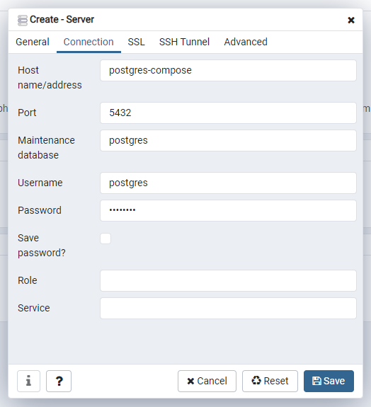

# Quartz Boot
> Spring Boot scheduling using Quartz and PostgreSQL to store job scheduling data

## Goal

Schedule a job manually using Quartz for schedule management in a clustered application.

## Requirements

* Java 11 (should work with Java 8 too)
* Docker (docker-compose used to setup PostgreSQL and PgAdmin)

## Starting the application

### 1. PostgreSQL and PgAdmin

* Start PostgreSQL and PgAdmin already configured in `docker-compose.yml` with the command

```sh
# inside the root folder
sudo docker-compose up
```

### 2. Create the database

* Login in PgAdmin accessing `http://localhost:16543` (user: postgres, pass: postgres);
* Connect to the PostgreSQL using the connection properties below (pass: postgres);



* Create a database named `quartzboot`;

### 3. Start the application

* run the command
```sh
mvn clean install && mvn spring-boot:run
```
* or simply run the project in your IDE

## Running the example

* Make a `POST` request to `localhost:8080/schedule`

The application must schedule a job to execute after 30 seconds and the execution must be logged like below:
```
2020-06-17 02:14:25.549  INFO 10876 --- [nio-8080-exec-3] b.c.p.quartzboot.service.JobServiceImpl  : Job scheduled to run at Wed Jun 17 02:14:55 GMT-03:00 2020
2020-06-17 02:14:55.535  INFO 10876 --- [eduler_Worker-1] b.com.platinum.quartzboot.job.SimpleJob  : Executing SimpleJob
```

## Attention points

### Quartz tables
Since the property `spring.quartz.jdbc.initialize-schema` has the value `always`, Quartz will drop and create `qrtz_*` tables every time the application starts.
If you want to keep the tables and values to simulate a service shutdown, do not forget to change de value to `never` before start the application again.
